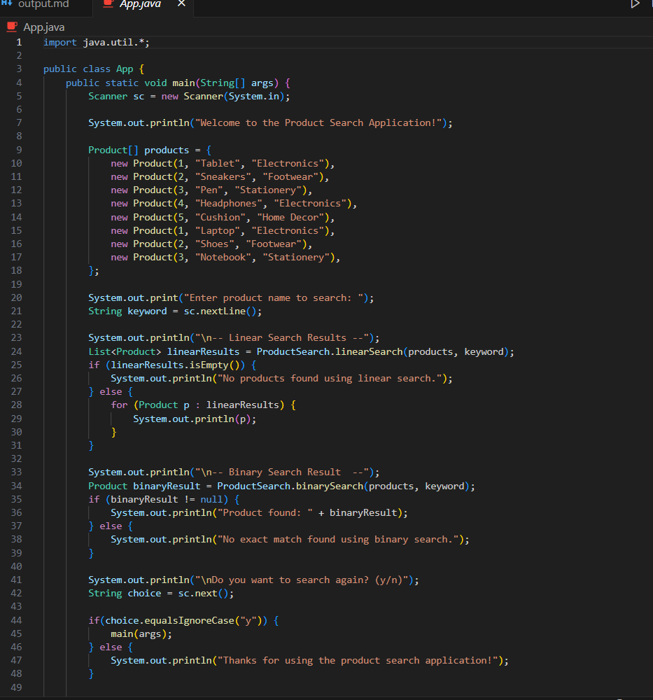
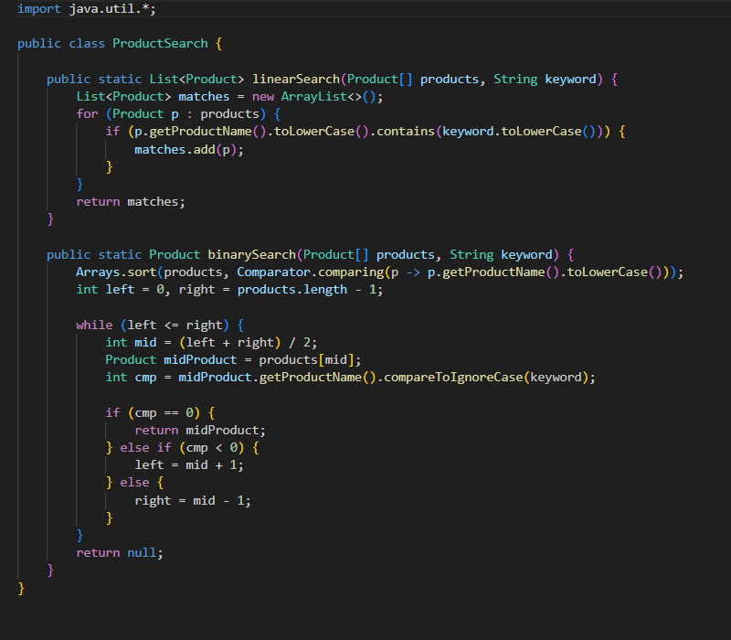
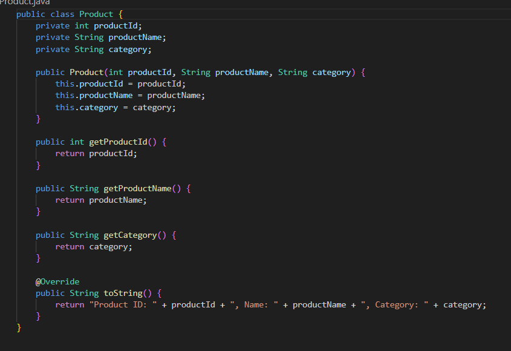
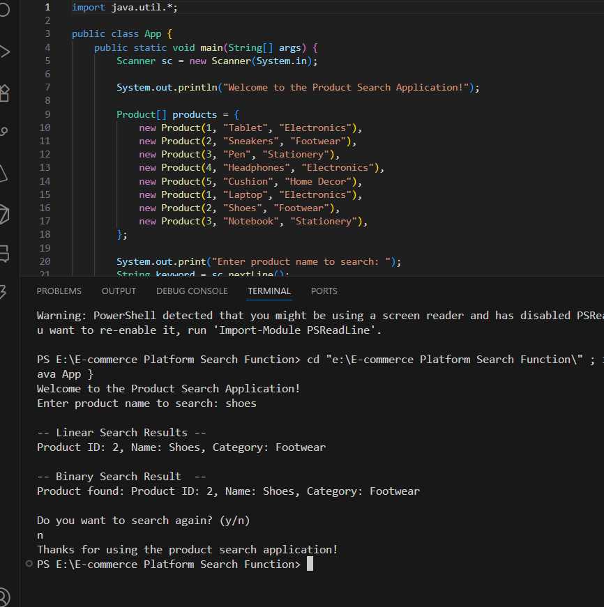

# E-commerce Platform Product Search

This is a simple Java console application that allows users to search for products by name using both linear and binary search algorithms.

## Features

- Search for products by name (case-insensitive)
- Linear search: Finds all products containing the keyword
- Binary search: Finds an exact match for the product name
- Sample product data included
- Option to search again or exit

## Files

- [`App.java`](App.java): Main application entry point and user interface
- [`Product.java`](Product.java): Product class definition
- [`ProductSearch.java`](ProductSearch.java): Implements linear and binary search algorithms

## How to Run

1. Compile the Java files:
    ```sh
    javac App.java Product.java ProductSearch.java
    ```
2. Run the application:
    ```sh
    java App
    ```

## Sample Output

### Code Screenshot





### Output Screenshot



---

