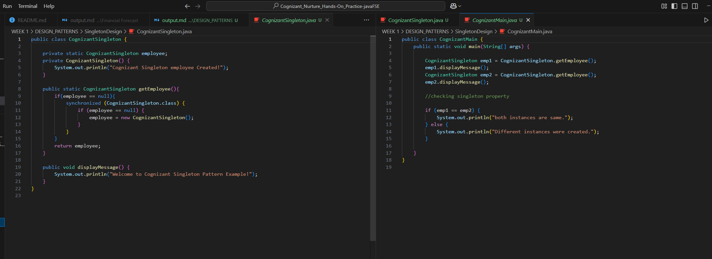
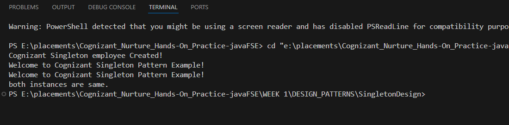

# 📌 Cognizant Singleton Pattern Demonstration

## 🎯 Objective  
Implement and showcase the **Singleton Design Pattern** in Java for the Cognizant Digital Nurture 4.0 submission. The goal is to guarantee a **single, globally‑accessible instance** while exploring multiple implementation strategies and their trade‑offs.

---

## 🧩 Basics of the Singleton Pattern  

| Aspect | Description |
|---|---|
| **Single Instance** | Only one object of the class exists for the entire JVM. |
| **Global Access Point** | The instance is retrieved through a static method (commonly `getInstance()`), providing universal access. |
| **Controlled Instantiation** | The constructor is marked `private`, preventing external creation and enforcing controlled access. |

Typical real‑world uses include loggers, configuration managers, database connection pools, and caching facilities.

---

## 🚀 What I Learned in This Project  

| Variant / Concept | Key Idea | Advantages | Caveats |
|---|---|---|---|
| **Eager Initialization** | Instance created **at class loading time**. | ✔️ Simple & thread‑safe out‑of‑the‑box. | ❌ Wastes memory if instance is never used. |
| **Lazy Initialization** | Instance created **on first request**. | ✔️ Saves resources until needed. | ❌ Needs extra care for thread safety. |
| **Thread Safety** | Ensure multiple threads don’t create separate instances. | `synchronized` keyword or other concurrency techniques (e.g., double‑checked locking). | Slight performance overhead. |
| **Method‑Level Synchronization** | Mark entire `getInstance()` as `synchronized`. | ✔️ Simple correctness. | ❌ Full method lock incurs the highest cost. |
| **Block‑Level Synchronization** | Synchronize only the critical section inside `getInstance()`. | ✔️ Better performance; lock acquired only when instance is null. | ❌ Slightly more complex code. |

---

## Sample Output

### Code Screenshot

### Output Screenshot

---

