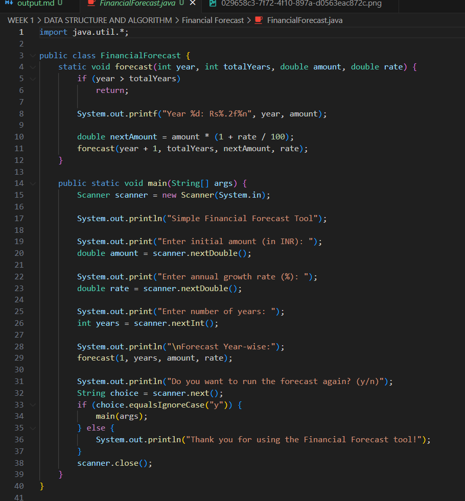
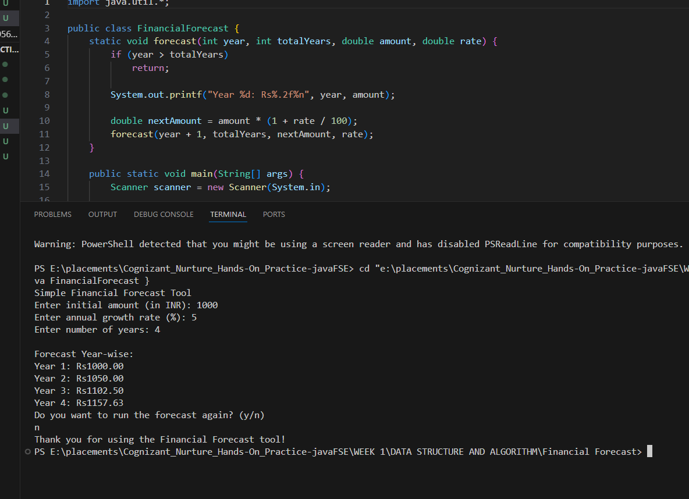

# Financial Forecast

This is a simple Java console application that calculates and forecasts the future value of an investment using recursion. It demonstrates how compound interest works over a period of years by using a recursive function to simulate annual growth.

---

## About the Project

This tool takes three inputs from the user:

* Initial amount (in INR)
* Annual growth rate (percentage)
* Number of years to forecast

It then prints a year-wise forecast showing how the investment grows over time, using a recursive function to calculate each year's amount.

---

## Key Features

* Uses recursion instead of loops for calculation
* Simple and clean output
* Console-based interaction
* Allows re-running the forecast without restarting the program

---

## What is Recursion?

Recursion is a method where a function calls itself to break down problems into smaller, easier-to-solve parts. It’s especially useful in problems that repeat in structure or can be divided into similar sub-problems.

### Structure of a Recursive Function:

* **Base Case:** The condition that stops the recursion
* **Recursive Case:** The logic where the function calls itself with a smaller input

### Benefits of Recursion:

* Cleaner, more elegant code
* Simplifies repetitive or hierarchical problems
* Good fit for mathematical problems like factorials, Fibonacci numbers, and tree traversals

---

## Forecast Logic (Java Code Snippet)

```java
static void forecast(int year, int totalYears, double amount, double rate) {
    if (year > totalYears) return;

    System.out.printf("Year %d: Rs%.2f%n", year, amount);

    double nextAmount = amount * (1 + rate / 100);
    forecast(year + 1, totalYears, nextAmount, rate);
}
```

This recursive function prints the amount for each year and calls itself for the next year until the specified number of years is reached.

---

## Time and Space Complexity

* **Time Complexity:** O(n) – One recursive call for each year
* **Space Complexity:** O(n) – Due to call stack for each recursive call

---

## How to Run

### Prerequisites

* Java 17 or higher installed

### Compile

```bash
javac FinancialForecast.java
```

### Run

```bash
java FinancialForecast
```

Follow the on-screen prompts. To run it again, just enter "y" when asked.

---

## Sample Output

### Code Screenshot



### Output Screenshot


---

## Possible Enhancements

* Monthly compounding
* Inflation-adjusted returns
* Export results to a file (CSV or JSON)
* Graphical visualization of the forecast

---

© Gaurav Singh 
