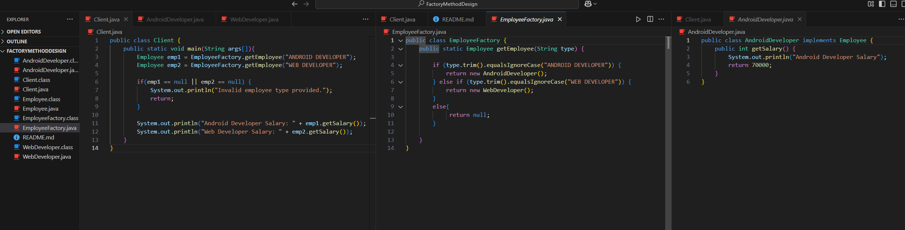
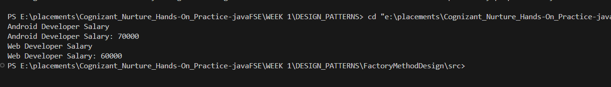

# 🏭 Factory Method Design Pattern – Employee Salary Example

## 📌 Project Title  
**Factory Method Design Pattern – Cognizant Java FSE Submission**

---

## 🎯 Objective  
Demonstrate the use of the **Factory Method Design Pattern** to create different types of `Employee` objects (like `AndroidDeveloper`, `WebDeveloper`) based on user input, without exposing the object creation logic directly to the client.

---

## 🧩 Key Concepts  

| Concept | Description |
|--------|-------------|
| **Factory Method Pattern** | A creational design pattern that provides an interface for creating objects in a superclass, but allows subclasses to alter the type of objects that will be created. |
| **Loose Coupling** | The client code (`Client.java`) does not depend on concrete classes like `AndroidDeveloper` or `WebDeveloper` directly. |
| **Polymorphism** | All employee types implement a common interface (`Employee`) which allows interchangeable use. |

---

## 📁 Project Structure

FactoryMethodDesign/
├── bin/ #  Compiled files
├── src/ # Java source files
│ ├── Client.java
│ ├── Employee.java
│ ├── EmployeeFactory.java
│ ├── AndroidDeveloper.java
│ └── WebDeveloper.java
└── snapshots/ # Screenshots for documentation
├── image.png
└── image-1.png

---

## 📁 Classes Used

| Class / Interface | Description |
|------------------|-------------|
| `Employee` | Interface that declares the method `getSalary()`. |
| `AndroidDeveloper` | Implements `Employee`. Returns salary specific to Android developers. |
| `WebDeveloper` | Implements `Employee`. Returns salary specific to Web developers. |
| `EmployeeFactory` | Factory class with a static method `getEmployee(String type)` that returns the correct object based on the string input. |
| `Client` | Contains the `main()` method and demonstrates the creation and use of employee objects via the factory. |

---

## 🔧 Sample Code  

### 📸 Code Screenshot  

---

### 🖥️ Output Screenshot  

---

## 🧠 What I Learned

- How to use the **Factory Method Pattern** to manage object creation.
- Achieving **abstraction** and **flexibility** by coding to interfaces.
- Reducing coupling between client code and concrete classes.
- Applying **open-closed principle** (open for extension, closed for modification).

---

## 📝 Submission Context

This project is prepared as part of **Cognizant Digital Nurture 4.0 – Java FSE Deep Skilling** for demonstrating Design Patterns in Java.

---
"""